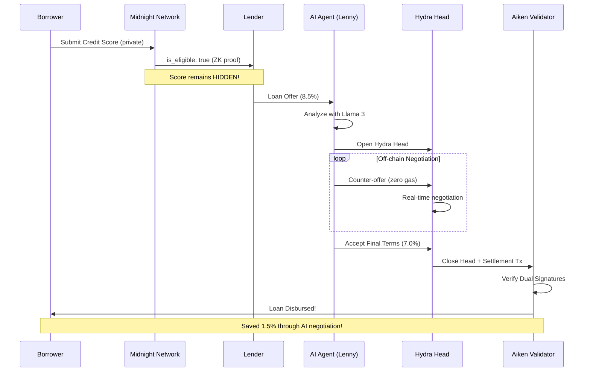

# Zkredit

**Privacy-First DeFi Lending**

Zkredit is a decentralized lending protocol that uses AI agents to negotiate loans in private Hydra Heads with zero gas fees, employing Midnight zero-knowledge proofs for credit scoring, and featuring an immersive dashboard interface.

## Quick Start

### Docker Deployment (Recommended)

```bash
# Full stack deployment
./deploy.sh

# Or manually
docker-compose up -d

# Production deployment
docker-compose -f docker-compose.prod.yml up -d
```

### Vercel Deployment (Cloud)

**IMPORTANT:** Vercel has a 250MB limit for serverless functions. The full backend with AI dependencies exceeds this limit.

**Deploy-Ready Strategy (single Vercel project):**

1. **Deploy from repository root:**
   ```bash
   vercel --prod
   ```
   - Builds `frontend/Dashboard` as a static SPA
   - Serves API from `api/index.py`
   - Routes `/api/*` and `/health` to the serverless API function

2. **Frontend environment variables (optional):**
   - `VITE_API_URL`
   - `VITE_WS_URL`
   
   If not set, frontend defaults to same-origin (recommended for this unified deployment).

3. **Full AI backend (optional external):**
   - Deploy full backend (`backend/api/server.py` + agents) to Railway/Render/Fly.io
   - Point `VITE_API_URL` and `VITE_WS_URL` to that external backend URL

**Access Points (unified Vercel mode):**
- Frontend: https://your-project.vercel.app
- API: https://your-project.vercel.app/api/dashboard/stats
- API Documentation: https://your-project.vercel.app/docs

**Docker Access Points:**
- Frontend: http://localhost:80
- Backend API: http://localhost:8000
- API Documentation: http://localhost:8000/docs

### Manual Setup

```bash
# Start Backend
cd backend/api
uvicorn server:app --host 0.0.0.0 --port 8000

# Start Frontend (separate terminal)
cd frontend/Dashboard
npm run dev

# Access:
# Frontend: http://localhost:8080
# API Docs: http://localhost:8000/docs
```

## Architecture



### Core Components

- **Midnight Network**: Zero-knowledge credit verification ([docs/midnight.md](docs/midnight.md))
- **Hydra Heads**: Layer 2 scaling for off-chain negotiations ([docs/hydra.md](docs/hydra.md))
- **AI Agents**: Automated loan analysis and negotiation ([docs/masumi.md](docs/masumi.md))
- **Aiken Validators**: On-chain settlement verification

### Data Flow

Borrower → Midnight ZK Check → Lender Offer → AI Analysis → Hydra Negotiation → Aiken Settlement

## Technology Stack

### Backend Components

| Component | Technology | Description |
|-----------|------------|-------------|
| AI Agents | CrewAI + Llama 3 | Loan negotiation automation |
| Layer 2 Scaling | Hydra Head Protocol | Zero-gas off-chain negotiations |
| Smart Contracts | Aiken Language | Settlement validation |
| Privacy Layer | Midnight Network | Zero-knowledge proofs |
| API Layer | FastAPI + WebSockets | Real-time communication |

### Frontend Components

| Component | Technology | Description |
|-----------|------------|-------------|
| UI Framework | React + TypeScript | Type-safe user interface |
| Build System | Vite | Fast development and bundling |
| Styling | Tailwind CSS | Utility-first CSS framework |
| State Management | React Query | Server state synchronization |

## Key Features

### Complete Lending Workflow

1. Privacy-Preserving Credit Checks - Zero-knowledge proofs via Midnight Network
2. AI-Powered Analysis - Local Llama 3 model analyzes loan terms
3. Layer 2 Negotiation - Zero-gas Hydra Head protocol for off-chain negotiation
4. Automated Settlement - Smart contract verification with dual signatures
5. Real-time Monitoring - WebSocket-based live updates

### AI Agent System

- Borrower Agent (Lenny) - Optimizes loan terms through negotiation
- Lender Agent (Luna) - Risk assessment and counter-offer evaluation
- Explainable AI - Decision logging with reasoning and confidence scores

### Frontend Dashboard

- Wallet Connection - Eternl, Nami, and other CIP-30 wallets
- Role Selection - Choose to be Borrower or Lender
- Stablecoin Selection - USDT, USDC, DAI with liquidity suggestions
- Auto-Confirm Toggle - Let AI auto-accept good deals
- Agent Conversations - Real-time negotiation chat between agents
- Workflow Visualizer - Live step-by-step progress
- Trade History - Completed loans with savings shown

## Installation

### Prerequisites

- Node.js 18+
- Python 3.10+
- Ollama (for local AI models)

### Setup

```bash
# Clone repository
git clone <repository-url>
cd Zkredit-AI

# Install dependencies
pip install -r requirements.txt
pip install -r backend/api/requirements.txt

cd frontend/Dashboard
npm install
cd ../..

# Install Ollama and models
curl -fsSL https://ollama.com/install.sh | sh
ollama pull llama3
```

### Running

```bash
# Terminal 1 - Backend
cd backend/api
uvicorn server:app --host 0.0.0.0 --port 8000

# Terminal 2 - Frontend
cd frontend/Dashboard
npm run dev

# Terminal 3 - Ollama
ollama serve
```

### Access Points

| Service | URL |
|---------|-----|
| Frontend | http://localhost:8080 |
| Backend API | http://localhost:8000 |
| API Documentation | http://localhost:8000/docs |

## API Reference

### Core Endpoints

| Endpoint | Method | Description |
|----------|--------|-------------|
| `/api/workflow/start` | POST | Initiate lending workflow |
| `/api/dashboard/stats` | GET | Get dashboard statistics |
| `/api/trades/history` | GET | Retrieve trade history |
| `/api/agent/status` | GET | Check AI agent status |
| `/ws` | WebSocket | Real-time updates |

## Project Structure

```
Zkredit-AI/
├── agents/                      # AI agent implementations
│   ├── borrower_agent.py       # Borrower negotiation agent
│   ├── lender_agent.py         # Lender evaluation agent
│   └── masumi/                 # Masumi Cardano analysis tools
├── backend/                    # Backend services
│   ├── api/server.py          # FastAPI backend server
│   ├── cardano/               # Cardano transaction builders
│   └── midnight/              # Midnight ZK client
├── contracts/                  # Aiken smart contracts
├── frontend/Dashboard/         # React frontend application
├── hydra/                     # Hydra Head protocol client
├── midnight/                  # Midnight compiled contracts
└── docs/                      # Documentation and guides
    ├── hydra.md               # Hydra Head protocol integration
    ├── midnight.md            # Midnight ZK proofs
    └── masumi.md              # Masumi AI agent system
```

## Configuration

### Environment Variables

Environment variables can be set in a `.env` file:

```env
# Backend Configuration
OLLAMA_BASE_URL=http://localhost:11434
HYDRA_NODE_URL=ws://127.0.0.1:4001
HYDRA_MODE=auto
PORT=8000

# Midnight Network (optional)
MIDNIGHT_API_URL=https://api.midnight.network
KUPO_BASE_URL=https://kupo-preprod.kupo.network

# Frontend Configuration
# Optional. If omitted, frontend uses same-origin URLs.
VITE_API_URL=http://localhost:8000
VITE_WS_URL=ws://localhost:8000/ws
```

## Development

### Testing

```bash
# Test Python syntax
python -m py_compile agents/*.py backend/api/server.py

# Build frontend
cd frontend/Dashboard
npm run build
```

### Vercel Deployment Notes

**CRITICAL:** Vercel has a **250MB unzipped size limit** for serverless functions. The full backend with AI dependencies exceeds this limit.

**Current Vercel mode in this repo:**

1. `vercel --prod` deploys both frontend and lightweight API from the same project.
2. Lightweight API supports dashboard endpoints used by the UI and mock workflow simulation.
3. For full AI negotiations with CrewAI/Ollama/Hydra websocket flows, use an external backend and set:
   - `VITE_API_URL`
   - `VITE_WS_URL`

**Other Vercel Limitations:**
- Ollama not available - Use external Ollama instance
- Function timeout - 10s limit (too short for AI negotiations)
- Storage limits - No persistent storage

**For Local Development:**
- Use Docker deployment (`./deploy.sh`)
- Ollama runs locally with full AI capabilities

### Post-Deploy Verification

Run the release health checklist script after each deployment:

```bash
scripts/post-deploy-check.sh https://your-project.vercel.app
```

Optional environment presence validation in your CI/CD shell:

```bash
REQUIRED_ENV_VARS="VITE_API_URL,VITE_WS_URL" \
scripts/post-deploy-check.sh https://your-project.vercel.app
```

## Resources

- [Hydra Head Protocol](https://hydra.family/head-protocol/)
- [Aiken Smart Contracts](https://aiken-lang.org/)
- [Midnight Network](https://midnight.network/)
- [CrewAI Framework](https://docs.crewai.com/)
- [Ollama](https://ollama.com/)

## Documentation

- [Hydra Integration](docs/hydra.md)
- [Midnight ZK Proofs](docs/midnight.md)
- [Masumi AI Agent](docs/masumi.md)
- [Deployment Guide](docs/DEPLOYMENT.md)

## License

MIT License
